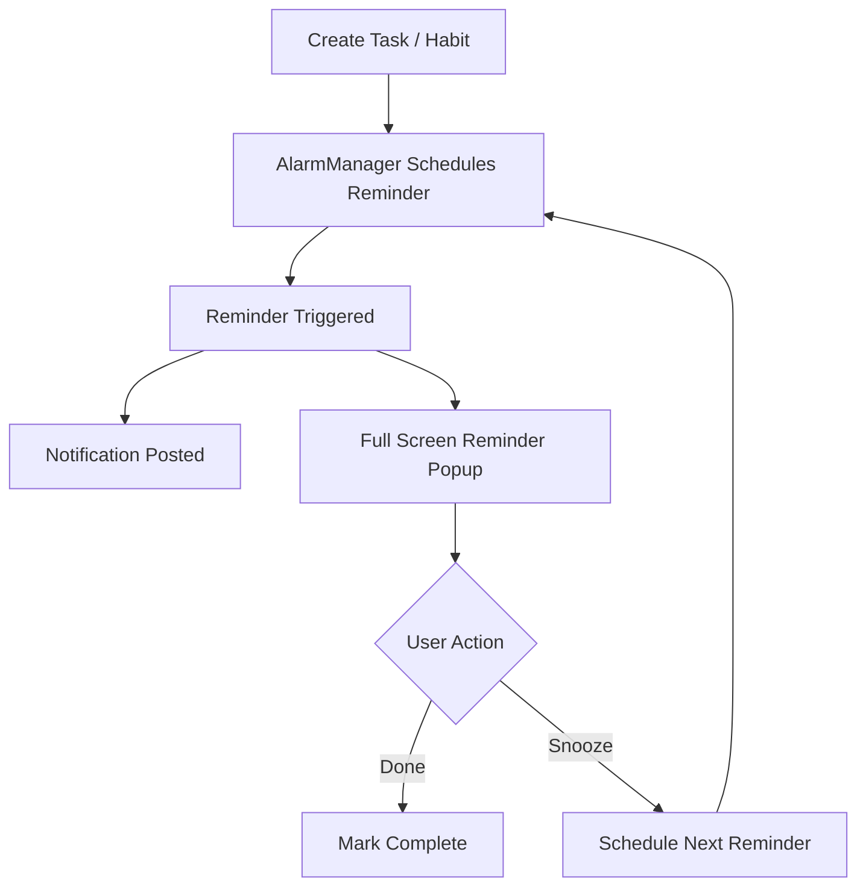

# 🔔 GrindBell

### Persistent Task & Habit Accountability System

[](https://kotlinlang.org/)
[](https://developer.android.com/jetpack/compose)
[](https://gradle.org/)
[](https://developer.android.com/)
[](https://developer.android.com/training/data-storage/room)
[](https://developer.android.com/reference/android/app/AlarmManager)
[](https://code.visualstudio.com/)

---

## 📖 Overview

**GrindBell** is a productivity-focused Android application designed for people who repeatedly forget important tasks, habits, deadlines, medications, study sessions, hydration schedules, and recurring responsibilities.

Unlike traditional to-do apps that send a single notification and disappear, GrindBell continuously reminds users until action is taken.

The application combines:

* Persistent Tasks
* Habit Tracking
* Repeat-Until-Done Reminders
* Alarm-Style Notifications
* Full-Screen Reminder Popups
* Analytics & Progress Tracking
* Home Screen Widgets

into a single accountability-focused productivity platform.

---

## 🎯 Core Philosophy

Most productivity apps assume users will remember after a single notification.

GrindBell assumes they won't.

Instead of:

> Reminder → Ignore → Forgotten

GrindBell follows:

> Reminder → Repeat → Repeat Again → Repeat Again → Complete

The reminder only stops when the user acts.

---

## ✨ Features

### 📋 Task Management

* Create tasks with custom due dates and times
* Priority system

  * Low
  * Medium
  * High
  * Critical
* Edit existing tasks
* Delete tasks
* Mark tasks complete
* Pin important tasks to dashboard
* Custom reminder intervals
* Repeat-until-done reminders

---

### 💧 Habit Tracking

Examples:

* Drink Water
* Medicine
* Exercise
* Study
* Stretch
* Eye Break

Features:

* Custom daily targets
* Progress tracking
* Frequency-based reminders
* Custom reminder intervals
* Completion counters
* Habit analytics
* Recurring reminder scheduling

Example:

Drink Water

Target:
5 times/day

Progress:
3/5

Completion:
60%

---

### 🔔 Persistent Reminder System

The core feature of GrindBell.

Supports:

* Exact alarm scheduling
* Repeating reminders
* Full-screen alerts
* Sound
* Vibration
* Notification panel controls

Actions:

* Done
* Snooze

Reminders continue until resolved.

---

### 🚨 Alarm Style Notifications

Supports:

* Background reminders
* Device locked reminders
* Full-screen reminder popups
* Sound alerts
* Vibration alerts
* High-priority notification channels

Reminder Modes:

* Normal
* Persistent
* Aggressive
* Critical Alarm

---

### 📊 Analytics

Track productivity across:

* Today
* Week
* Month

Metrics:

* Tasks Completed
* Tasks Missed
* Habits Completed
* Habit Progress
* Completion Rate
* Reminder Response Rate

All analytics are generated from actual database records.

---

### 🎨 Modern UI

Built with:

* Jetpack Compose
* Glassmorphism-inspired cards
* Floating navigation dock
* Gradient progress cards
* Responsive layouts
* Smooth animations

Inspired by:

* Linear
* Arc Browser
* Notion Calendar
* Modern SaaS dashboards

---

## ⚙ Reminder Flow



---

## 🏗 Architecture

```text
app/
├── data/
│   ├── local/
│   ├── dao/
│   ├── entities/
│   └── repository/
│
├── domain/
│   ├── models/
│   └── usecases/
│
├── presentation/
│   ├── dashboard/
│   ├── tasks/
│   ├── habits/
│   ├── analytics/
│   ├── settings/
│   └── components/
│
├── services/
│   ├── alarms/
│   ├── notifications/
│   ├── receivers/
│   └── reminders/
│
└── widgets/
```

---

## 🛠 Technical Stack

### Frontend

* Kotlin
* Jetpack Compose
* Material 3

### Backend (On Device)

* Room Database
* DataStore

### Reminder Engine

* AlarmManager
* BroadcastReceiver
* Foreground Services
* Notification Channels

### Architecture

* MVVM
* Repository Pattern
* StateFlow
* Coroutines

---

## 📦 Installation

### Clone Repository

```bash
git clone https://github.com/d-ghosh717/GrindBell
cd GrindBell
```

### Build

```powershell
.\gradlew.bat assembleDebug
```

### Install

```powershell
adb install app\build\outputs\apk\debug\app-debug.apk
```

### Launch

```powershell
adb shell am start -n com.grindbell.app/.MainActivity
```

---

## 🔧 Useful Commands

### Clean Build

```powershell
.\gradlew.bat clean
```

### Build APK

```powershell
.\gradlew.bat assembleDebug
```

### Install APK

```powershell
adb install app\build\outputs\apk\debug\app-debug.apk
```

### View Logs

```powershell
adb logcat
```

---

## 🚀 Development Roadmap

### ✅ Completed

* Task creation & management
* Habit tracking
* Alarm scheduling
* Persistent reminders
* Analytics dashboard
* Modern Compose UI
* Room database integration
* Full-screen reminder architecture

### 🚧 In Progress

* Advanced widgets
* Reminder reliability improvements
* Improved habit reminder engine
* Export / backup support

### 📅 Planned

* Cross-device sync
* Wear OS support
* Calendar integration
* Smart scheduling
* Advanced productivity insights

---

## 🤝 Contributing

Contributions are welcome.

1. Fork repository
2. Create feature branch
3. Commit changes
4. Push branch
5. Open Pull Request

---

## 📜 License

This project is intended for educational and personal productivity purposes.

---

## 💡 Why GrindBell?

Most reminder apps notify once and disappear.

GrindBell is built around a different idea:

> The reminder should stop only when the task is actually done.
